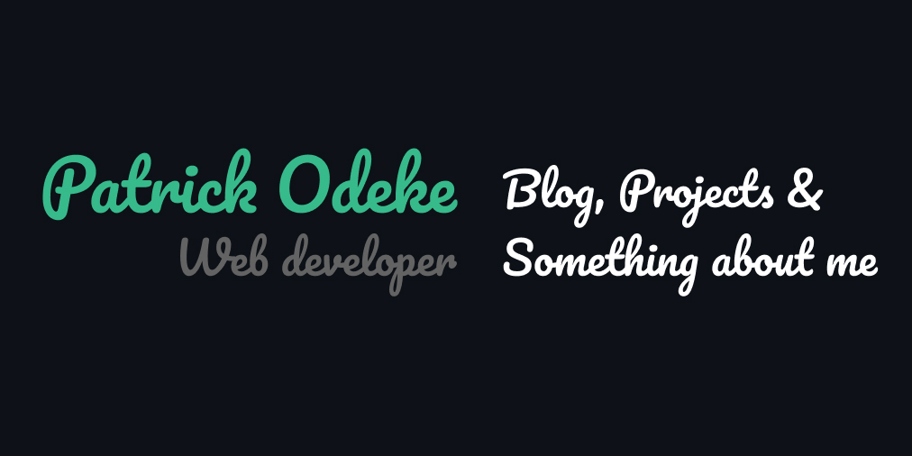

# **Hello there** 👋 

I'm a web developer, freelancer and enthusiast from Katakwi, Uganda. Making the world a better place, one intuitive design at a time.I'm currently freelancing and building solutions that are both front end and full stack.

## 💼 **Portfolio**

Check out some of my recent projects and work on my portfolio [website 🔗](https://github.com/odkpatrick/)

## ✍🏻 **Blog and Content**

Aside from coding, I also write blogs and create lessons and content for youtube.
- [Blog](https://github.com/odkpatrick/) 🔗
- [Dev.to](https://github.com/odkpatrick/) 🔗
- [Youtube](https://github.com/odkpatrick/) 🔗

## 🔧 **Technologies and tools**

## 📈 **Github stats**

